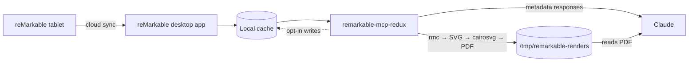
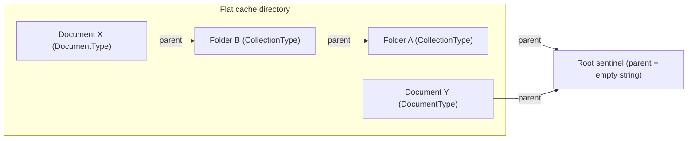

# remarkable-mcp-redux

An MCP server that gives Claude direct access to your reMarkable tablet's notebooks. Search documents, render handwritten pages to PDF, and let Claude transcribe your handwriting or convert hand-drawn diagrams into editable formats — all from your local machine, no API keys required.

## About this fork

This is a fork of [SamMorrowDrums/remarkable-mcp](https://github.com/SamMorrowDrums/remarkable-mcp). The core idea and rendering pipeline originate there. This fork reorganises the project into a proper Python package (`remarkable_mcp_redux`) and adds:

- **Pydantic schema validation** at the cache boundary — `.metadata` and `.content` JSON is parsed and validated into typed models, with ISO-8601 timestamp normalisation and discriminated unions for document vs. folder types.
- **Enriched document metadata** — responses include `file_type`, `document_title`, `authors`, `tags`, `annotated`, `original_page_count`, and `size_in_bytes` sourced from `.content`.
- **Folder listing** — `remarkable_list_folders` exposes `CollectionType` records; `remarkable_list_documents` now correctly excludes them.
- **Filtering** — `remarkable_list_documents` accepts `file_type` and `tag` query parameters.
- **Robust render error handling** — non-zero `rmc` exit codes surface as per-page failures in the response rather than being swallowed.
- **Opt-in write-back tools** — eight write tools covering rename, move, pin, restore, create-folder, rename-folder, move-folder, and bulk backup cleanup. All are guarded behind `REMARKABLE_ENABLE_WRITE_TOOLS=true` and ship with `dry_run`, atomic writes, automatic sync-flag stamping, and per-document timestamped backups.
- **Sync-aware writes** — every write sets `metadatamodified=True` and `modified=True` so the reMarkable desktop sync engine recognises local edits; folder operations enforce cycle-safety via a parent-chain check, and trashed records are refused with explicit errors.
- **Auto-pruned backups** — each document's `.metadata.bak.*` chain is bounded after every write (default keep last 5, configurable via `REMARKABLE_BACKUP_RETENTION_COUNT`); a bulk `remarkable_cleanup_metadata_backups` tool also offers age- and document-scoped sweeps.
- **Expanded test suite** — 130+ tests across unit, integration, and e2e layers using entirely synthetic fixtures.

## How it works

The reMarkable desktop app keeps a local copy of your tablet's notebooks and
documents on your Mac. This MCP server reads (and optionally edits) that local
copy, then exposes it to Claude as a small set of tools.



The dotted edge marks the opt-in write path; everything else is read-only by
default. **No API keys. No cloud access. Everything runs locally.** The
desktop app handles syncing; this server just reads (and, opt-in, edits) the
files it produces.

### The cache mental model

The desktop cache is **not** a tree of folders on disk. It is a flat directory
of records, each addressed by a UUID. For every document or folder you have,
the cache stores a few sibling files keyed by that id:

- `<id>.metadata` — a small JSON blob with `visibleName`, `parent`, `type`
  (`DocumentType` or `CollectionType`), `lastModified`, `deleted`, `pinned`,
  and the sync flags (`metadatamodified`, `modified`).
- `<id>.content` — structural info: `fileType` (`pdf`, `notebook`, `epub`),
  page index, tags, original page count, embedded title/authors, size.
- `<id>/...` — per-page data used for rendering (notebook pages live here as
  `.rm` files alongside any source assets).

Folders are records too. A folder is a `.metadata` file with
`type: "CollectionType"`, and "X is inside folder Y" is expressed by X's
`parent` field pointing at Y's id. The empty string `""` means the root;
`"trash"` is a sentinel for the trash bin.



Every record on disk is a peer in the cache directory. Hierarchy lives only
in the `parent` arrows above, not in the filesystem layout.

### Why "move" only writes metadata

Because containment lives in metadata, moving a document or folder does **not**
relocate any files on disk. `remarkable_move_document` and
`remarkable_move_folder` rewrite the target's `<id>.metadata` with a new
`parent` value and re-stamp `lastModified`, `metadatamodified=true`, and
`modified=true` so the desktop sync engine notices the local edit on its next
pass. The source PDF, notebook pages, and any other blobs stay exactly where
they were. Renames and pins follow the same pattern — a single field changes
in the same `.metadata` JSON, written atomically with a timestamped backup.

This is the same pattern most sync-friendly apps (Drive, Dropbox, photo
libraries, note apps) use: stable record ids, with hierarchy expressed as
relationships rather than filesystem paths. It keeps moves cheap, sync deltas
small, and avoids the path/encoding/duplicate-name problems that filesystem
hierarchies bring.

### Source cache vs. rendered output

There are two distinct piles of files to keep separate:

- **The reMarkable cache**
  (`~/Library/Containers/com.remarkable.desktop/.../desktop`). Owned by the
  desktop app. Read by every tool. Mutated only by the opt-in write tools, and
  only via atomic `.metadata` writes with timestamped backups.
- **Render output** (`/tmp/remarkable-renders/` by default). Owned by this
  server. `remarkable_render_pages` and `remarkable_render_document` write
  `<doc_id>.pdf` here for Claude to read; `remarkable_cleanup_renders` clears
  it. Nothing here is synced anywhere — it's a scratch directory.

Move, rename, and pin operations only touch the cache; they never update or
relocate anything in the render directory.

## Prerequisites

- **reMarkable desktop app** — installed and synced ([download](https://remarkable.com/desktop))
- **macOS** — the server reads from the standard macOS cache path (Linux support is possible but untested)
- **Python 3.12+**
- **uv** — Python package manager ([install](https://docs.astral.sh/uv/))
- **cairo** — system graphics library for SVG→PDF rendering:
  ```bash
  brew install cairo
  ```

## Installation

```bash
git clone https://github.com/<your-username>/remarkable-mcp-redux.git
cd remarkable-mcp-redux
uv sync
```

## MCP Registration

Add the server to your Claude Code MCP configuration. See `mcp.example.json` for the full template, or add this to your `.mcp.json`:

```json
{
  "mcpServers": {
    "remarkable": {
      "type": "stdio",
      "command": "/bin/bash",
      "args": [
        "-c",
        "cd '/path/to/remarkable-mcp-redux' && exec uv run remarkable-mcp"
      ]
    }
  }
}
```

Replace `/path/to/remarkable-mcp-redux` with the actual path to your cloned repo.

`uv run remarkable-mcp` invokes the `remarkable-mcp` script entry point declared in
`pyproject.toml`. The server sets `DYLD_LIBRARY_PATH=/opt/homebrew/lib` automatically
at startup (via `config.ensure_cairo_library_path()`), so no manual export is needed.

## Tools

### Read-only tools (always registered)

| Tool | Description |
|------|-------------|
| `remarkable_check_status` | Diagnostics — cache exists? rmc available? cairo available? |
| `remarkable_list_documents` | List documents (folders excluded) with optional `search`, `file_type`, and `tag` filters |
| `remarkable_list_folders` | List folder records (`CollectionType`) with their parent ids |
| `remarkable_get_document_info` | Detailed metadata for a document (rejects folders) |
| `remarkable_render_pages` | Render selected pages to a single PDF |
| `remarkable_render_document` | Render all pages of a document to PDF |
| `remarkable_cleanup_renders` | Remove temporary rendered PDFs |

Document responses are enriched from `.content` with `file_type`, `document_title`,
`authors`, `tags`, `annotated`, `original_page_count`, and `size_in_bytes`. Timestamps
(`last_modified`) are normalized to ISO-8601.

### Write-back tools (opt-in)

| Tool | Description |
|------|-------------|
| `remarkable_rename_document` | Update a document's `visibleName` |
| `remarkable_rename_folder` | Update a folder's `visibleName` (sibling-uniqueness enforced) |
| `remarkable_move_document` | Move a document to a different folder (or root) |
| `remarkable_move_folder` | Move a folder to a different parent; response includes `descendants_affected` |
| `remarkable_create_folder` | Create a new folder under any existing folder (or root); two-file atomic write |
| `remarkable_pin_document` | Set or clear a document's `pinned` flag |
| `remarkable_restore_metadata` | Restore a record's `.metadata` from its most recent timestamped backup (undo) |
| `remarkable_cleanup_metadata_backups` | Bulk-delete `.metadata.bak.*` files by age or document id |

These tools mutate the local cache and are **disabled by default**. Enable them by
setting `REMARKABLE_ENABLE_WRITE_TOOLS=true` in the server's environment.

Safety guarantees:

- Every tool accepts `dry_run=true` to preview without writing.
- Every successful write sets `metadatamodified=True` and `modified=True` on the
  affected `.metadata` so the reMarkable sync engine recognises the edit.
- Every successful write creates a timestamped `<doc_id>.metadata.bak.<UTC>`
  backup before mutation. Use `remarkable_restore_metadata` as the undo lever -
  it creates a pre-restore backup of the live state first, so the restore itself
  is reversible.
- Per-document backup chains are auto-pruned after every write to keep the most
  recent N (default 5; override with `REMARKABLE_BACKUP_RETENTION_COUNT`).
  `remarkable_cleanup_metadata_backups` covers ad-hoc cleanup across the cache.
- Writes go through a same-directory temp file plus `os.replace`, so a crash
  mid-write cannot leave the cache in a half-written state. Folder creation
  uses a two-file atomic write (`.content` then `.metadata`) and rolls back the
  `.content` if the `.metadata` write fails.
- Targets are validated: rename refuses empty names and trashed records; move
  requires `""` (root) or an existing `CollectionType` folder id, refuses the
  `"trash"` sentinel, refuses moves into the source's own subtree, and (for
  folder moves) reports the descendant count up front.
- **Pause reMarkable desktop sync** before invoking write tools to avoid racing
  with the desktop app's own writes; resume after to push the changes back.

### Sync behaviour

The reMarkable desktop app continuously syncs the local cache with the cloud.
A few things to keep in mind when using this server:

- **Read staleness.** A read tool returns whatever was on disk at the moment it
  ran. If sync writes a new revision a millisecond later, your response is one
  revision out of date - reissue the call to refresh.
- **Active-sync race for writes.** The desktop app does not advertise a "sync
  busy" flag this server can poll, so the safest workflow is: pause sync,
  invoke write tools, verify on disk, resume sync. Each write sets
  `metadatamodified=True` and `modified=True` automatically, which is what the
  desktop app uses to flag a record as "changed locally, push on next sync".
- **Undo path.** Every write creates a timestamped backup. `remarkable_restore_metadata`
  rolls a single record back to its previous state. The restore itself creates
  a pre-restore safety backup, so re-restoring re-applies the change you just
  undid - useful for A/B testing renames or moves.
- **Backup retention.** Per-document chains are auto-pruned after every write.
  Default is "keep the last 5"; set `REMARKABLE_BACKUP_RETENTION_COUNT=N`
  (`0` = "keep none beyond the one made for this write"). Bulk cleanup is
  available via `remarkable_cleanup_metadata_backups` and requires an explicit
  filter (age or doc id) so an empty call cannot accidentally wipe history.

### Page selection

`remarkable_render_pages` supports flexible page selection:

```python
# Last 5 pages of a document
remarkable_render_pages(doc_id="<uuid>", last_n=5)

# First 3 pages
remarkable_render_pages(doc_id="<uuid>", first_n=3)

# Specific pages (0-indexed)
remarkable_render_pages(doc_id="<uuid>", page_indices=[0, 2, 4])

# All pages (no selection args)
remarkable_render_pages(doc_id="<uuid>")
```

Priority: `page_indices` > `last_n` > `first_n` > all pages. An empty
`page_indices=[]` is rejected explicitly.

## Usage with Claude

Once registered, Claude can access your reMarkable notebooks directly:

> "Transcribe the last 3 pages of my journal"

> "Find my notebook called 'Architecture Notes' and render page 5"

> "What documents do I have on my reMarkable?"

The rendered PDFs are saved to `/tmp/remarkable-renders/` and can be cleaned up with `remarkable_cleanup_renders`.

## Companion Skills

The `skills/` directory contains Claude Code skill definitions that wrap the MCP tools into complete workflows:

- **`remarkable-transcribe.md`** — Transcribe handwritten notes to clean Markdown
- **`remarkable-diagram.md`** — Convert hand-drawn diagrams to interactive Excalidraw files

To use these, copy the skill files into your `~/.claude/skills/` directory (or symlink them).

## Architecture

```
remarkable-mcp-redux/
├── remarkable_mcp_redux/           # Package
│   ├── __init__.py
│   ├── config.py                   # Default paths, env-flag helpers, retention, Cairo setup
│   ├── schemas.py                  # Pydantic models for .metadata and .content JSON
│   ├── _cache.py                   # Read-only cache loader (parses raw JSON via schemas)
│   │                               # - is_descendant_of / count_descendants for cycle safety
│   ├── _render.py                  # rmc → SVG → cairosvg → PDF pipeline
│   ├── _writes.py                  # Atomic, backup-protected mutations:
│   │                               # - MetadataWriter (rename / move / pin)
│   │                               # - MetadataRestorer (undo from latest backup)
│   │                               # - MetadataCreator (folder creation)
│   │                               # - cleanup_backups (bulk pruning helper)
│   ├── client.py                   # RemarkableClient facade (public API)
│   ├── _tools.py                   # MCP tool registration (read + opt-in write)
│   └── server.py                   # FastMCP entry point + build_server()
├── skills/
│   ├── remarkable-transcribe.md    # Handwriting → Markdown skill
│   └── remarkable-diagram.md       # Diagram → Excalidraw skill
└── tests/
    ├── conftest.py                 # Synthetic cache fixtures (docs + folders + nested + iOS)
    ├── test_remarkable_client.py   # Unit tests
    ├── test_server.py              # Integration / write-tool gating tests
    └── test_e2e.py                 # End-to-end stdio tests
```

The rendering pipeline:

1. **rmc** parses reMarkable's proprietary `.rm` binary format (v6) into SVG. Non-zero
   `rmc` exit codes now surface as failed pages in the response.
2. **cairosvg** converts SVG to PDF
3. **pypdf** merges per-page PDFs into a single document
4. Claude reads the PDF and does whatever you need — transcription, diagram interpretation, summarization

## Tests

```bash
# All tests
uv run pytest tests/ -v

# By category
uv run pytest tests/ -m unit          # unit tests (synthetic cache)
uv run pytest tests/ -m integration   # tool registration and response shapes
uv run pytest tests/ -m e2e           # full stdio transport
```

Tests use synthetic fixtures — no real reMarkable device or cache required.

## License

MIT — see [LICENSE](LICENSE).
